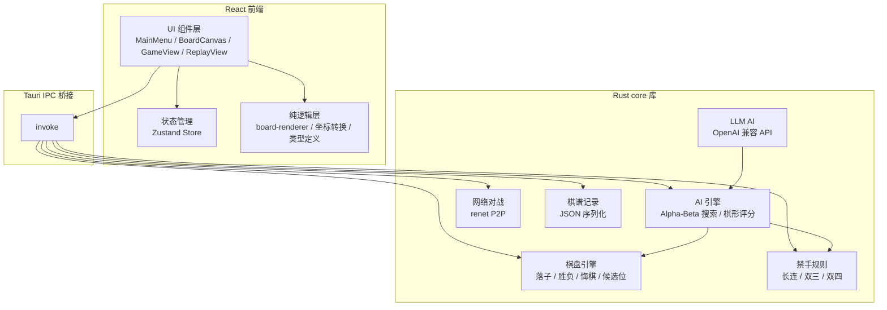
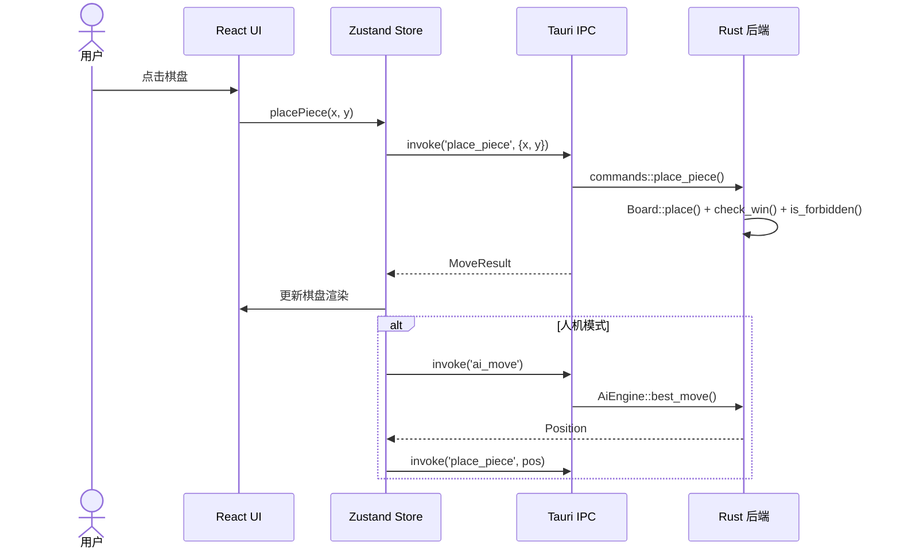

<p align="center">
  <h1>Gobang</h1>
  <p>五子棋桌面应用 — Rust + Tauri + React 构建</p>
</p>

<p align="center">
  
  
  
  
  
  
  
</p>

---

## 简介

Gobang 是一款五子棋桌面应用，支持本地双人、人机对战、网络联机和棋谱回放。

v2.0 使用 **Tauri 2.x + React 19 + TypeScript + Rust** 完全重写，替代了原有的 C + IUP GUI。

## 架构



### 数据流



## 功能

### 游戏模式

- **本地双人** — 同机两人轮流落子
- **人机对战** — Alpha-Beta 剪枝 AI，5 级难度可调
- **网络对战** — renet P2P 联机（纯 Rust ENet 协议）
- **LLM AI** — 大模型 API 接入对战（OpenAI 兼容接口）

### 游戏规则

- 标准五子棋规则，黑方先手
- **禁手规则**（可开关）：长连禁手、双三禁手、双四禁手
- 悔棋功能

### 棋谱

- JSON 格式棋谱记录与回放
- 步进滑块逐帧复盘
- 自动播放模式

### 界面

- Canvas 木纹风格棋盘渲染
- 棋子径向渐变 + 最后一手红圈高亮
- 中 / English 界面切换
- 计时器（可选）

## 安装

从 [Releases](https://github.com/LHY0125/Gobang-Game/releases) 下载最新版安装包。

或从源码构建：

```bash
npm install
npx tauri build
```

> **要求**：Windows 10+（自带 WebView2）。

## 开发

```bash
# 开发模式 GUI（热更新）
npx tauri dev

# 仅前端
npm run dev

# 前端测试
npm test

# Rust 检查
cargo check
cargo clippy -- -D warnings

# Rust 测试
cargo test

# 完整构建
npx tauri build
```

### 技术栈

| 层 | 技术 |
|---|---|
| 前端框架 | React 19 + TypeScript (strict) |
| 状态管理 | Zustand |
| 国际化 | i18next |
| 桌面框架 | Tauri 2.x |
| 核心库 | Rust workspace (core + gui) |
| 网络 | renet |
| 棋谱 | serde_json |
| Rust 测试 | cargo test (26 个测试) |
| 构建 | Vite + Cargo |

### 项目结构

```
core/                         # Rust 核心库（零 Tauri 依赖）
├── types.rs                  # 类型定义 (Position, Color, Board, GameConfig)
├── board.rs                  # 棋盘引擎 (落子/胜负/悔棋/候选位)
├── rules.rs                  # 禁手规则 (长连/双三/双四)
├── ai/
│   ├── evaluate.rs           # 棋形评分 (连五/活四/冲四/活三)
│   └── search.rs             # Alpha-Beta 搜索 + Negamax
├── record.rs                 # JSON 棋谱记录与复盘
├── network.rs                # renet 网络对战协议
└── llm.rs                    # LLM AI (OpenAI 兼容 API)
gui/                          # Tauri 桌面应用
└── src/
    ├── lib.rs                # Tauri Builder + 状态管理
    ├── commands.rs           # IPC 命令 (薄层调用 core)
    └── main.rs               # 入口
src/                          # React 前端
├── core/                     # 纯逻辑 (types, constants)
├── store/                    # Zustand 状态管理
├── components/
│   ├── board/                # BoardCanvas + board-renderer
│   ├── menu/                 # MainMenu / LocalGame / AiGame / Online / Replay
│   ├── game/                 # GameView / GameInfo / TimerDisplay / GameControls
│   └── replay/               # ReplayView / StepSlider / ReplayControls
├── hooks/                    # 通用 hooks
└── i18n/                     # zh-CN / en
docs/                         # 设计文档与实施计划
```

## 贡献

欢迎提交 Issue 和 Pull Request。大改动前建议先开 Issue 讨论。

### 本地开发环境

- Node.js 22+
- Rust 1.95+ (stable-x86_64-pc-windows-gnu)
- MinGW-w64
- Windows 10+

### 代码规范

- TypeScript `strict: true`，零编译错误
- Rust `cargo clippy -- -D warnings` 零警告
- AI 引擎通过 `AiEngine` trait 抽象，可替换

## 许可证

MIT License

## 作者

[刘航宇](https://github.com/LHY0125) — 河南理工大学人工智能协会
