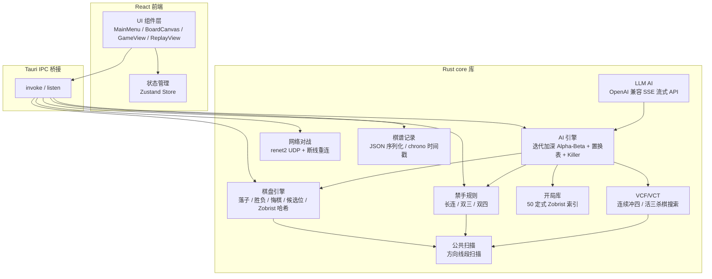
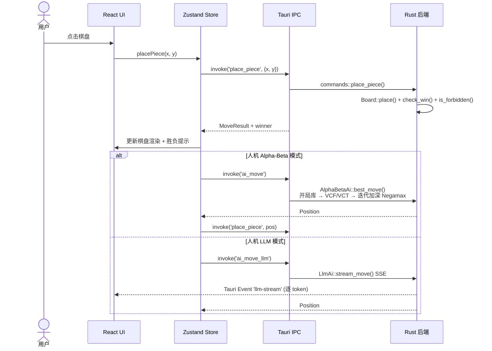

<p align="center">
  <h1>Gobang</h1>
  <p>五子棋桌面应用 — Rust + Tauri + React 构建</p>
</p>

<p align="center">
  
  
  
  
  
  
  
</p>

---

## 简介

Gobang 是一款五子棋桌面应用，支持本地双人、人机对战、网络联机和棋谱回放。

v2.0 使用 **Tauri 2.x + React 19 + TypeScript + Rust** 完全重写，替代了原有的 C + IUP GUI。

## 架构


```mermaid
graph TB
    subgraph 前端["React 前端"]
        UI[UI 组件层<br/>MainMenu / BoardCanvas / GameView / ReplayView]
        Store[状态管理<br/>Zustand Store]
        UI --> Store
    end

    subgraph IPC["Tauri IPC 桥接"]
        invoke[invoke / listen]
    end

    subgraph 后端["Rust core 库"]
        Board[棋盘引擎<br/>落子 / 胜负 / 悔棋 / 候选位 / Zobrist 哈希]
        Rules[禁手规则<br/>长连 / 双三 / 双四]
        Scan[公共扫描<br/>方向线段扫描]
        AI[AI 引擎<br/>迭代加深 Alpha-Beta + 置换表 + Killer]
        Opening[开局库<br/>50 定式 Zobrist 索引]
        VCF[VCF/VCT<br/>连续冲四 / 活三杀棋搜索]
        LLM[LLM AI<br/>OpenAI 兼容 SSE 流式 API]
        Network[网络对战<br/>renet2 UDP + 断线重连]
        Record[棋谱记录<br/>JSON 序列化 / chrono 时间戳]
    end

    UI --> invoke
    invoke --> Board
    invoke --> AI
    invoke --> Network
    invoke --> Record
    invoke --> Rules
    LLM --> AI
    AI --> Board
    AI --> Rules
    AI --> Opening
    AI --> VCF
    Board --> Scan
    Rules --> Scan
    VCF --> Scan
```

### 数据流


```mermaid
sequenceDiagram
    actor U as 用户
    participant UI as React UI
    participant Z as Zustand Store
    participant IPC as Tauri IPC
    participant R as Rust 后端

    U->>UI: 点击棋盘
    UI->>Z: placePiece(x, y)
    Z->>IPC: invoke('place_piece', {x, y})
    IPC->>R: commands::place_piece()
    R->>R: Board::place() + check_win() + is_forbidden()
    IPC-->>Z: MoveResult + winner
    Z->>UI: 更新棋盘渲染 + 胜负提示

    alt 人机 Alpha-Beta 模式
        Z->>IPC: invoke('ai_move')
        IPC->>R: AlphaBetaAi::best_move()<br/>开局库 → VCF/VCT → 迭代加深 Negamax
        R-->>Z: Position
        Z->>IPC: invoke('place_piece', pos)
    else 人机 LLM 模式
        Z->>IPC: invoke('ai_move_llm')
        IPC->>R: LlmAi::stream_move() SSE
        R-->>UI: Tauri Event 'llm-stream' (逐 token)
        R-->>Z: Position
    end
```

## 功能

### 游戏模式

- **本地双人** — 同机两人轮流落子
- **人机对战** — Alpha-Beta 剪枝 AI，5 级难度可调
- **LLM AI** — 大模型 API 接入对战（OpenAI 兼容接口，SSE 流式输出思考过程）
- **网络对战** — renet2 UDP P2P 联机，支持断线重连

### AI 引擎

- **迭代加深** Alpha-Beta + Negamax 搜索
- **置换表**（1M 条目，Zobrist 索引，depth 优先替换）
- **Killer Move** 启发（每层 2 槽位）
- **开局库**（50 个标准定式，Zobrist 随机选取）
- **VCF/VCT** 杀棋搜索（连续冲四 / 活三取胜）
- **组合棋形**评估（双活三、三四、双四加分）
- **位置权重**（高斯分布，中心优先）

### 游戏规则

- 标准五子棋规则，黑方先手
- **禁手规则**（可开关）：长连(≥6)、双三、双四
- 严格活三检测：至少一端能延伸成活四
- 悔棋功能
- 胜负判定 + 胜者显示

### 棋谱

- JSON 格式棋谱记录与回放（chrono ISO 8601 时间戳）
- 步进滑块逐帧复盘
- 自动播放模式（500ms/步）

### 界面

- Canvas 木纹风格棋盘渲染
- 棋子径向渐变 + 最后一手红圈高亮 + 星位标记
- 中 / English 界面切换（i18next）
- 计时器（可选，双方独立倒计时 + 超时判负）
- LLM 思考过程实时显示

## 安装

从 [Releases](https://github.com/LHY0125/Gobang-Game/releases) 下载最新版安装包。

或从源码构建：

```bash
npm install
npx tauri build
```

> **要求**：Windows 10+（自带 WebView2），Rust 1.95+ (stable-x86_64-pc-windows-gnu)，Node.js 22+

## 开发

```bash
# 开发模式 GUI（热更新）
npx tauri dev

# 仅前端
npm run dev

# 前端类型检查
npx tsc -b

# 前端测试（18 个）
npm test

# Rust 检查
cargo check
cargo clippy -- -D warnings

# Rust 测试（53 个）
cargo test

# Rust 格式化
cargo fmt

# 完整构建（生成 NSIS 安装包）
npx tauri build
```

### 技术栈

| 层 | 技术 |
|---|---|
| 前端框架 | React 19 + TypeScript (strict) |
| 状态管理 | Zustand |
| 国际化 | i18next |
| 桌面框架 | Tauri 2.x |
| 核心库 | Rust workspace (core + gui) |
| 网络 | renet2 + renet2_netcode (UDP) |
| HTTP | reqwest 0.12 (JSON + SSE stream) |
| 日期 | chrono 0.4 |
| 序列化 | serde + serde_json + bincode |
| 解析 | regex |
| 随机 | rand 0.8 |
| 棋谱 | serde_json |
| 前端测试 | Vitest |
| 构建 | Vite + Cargo |
| CI/CD | GitHub Actions (Windows + Ubuntu) |

### 项目结构

```
core/                              # Rust 核心库（零 Tauri 依赖）
├── types.rs                       # 类型定义 (Color, Position, GameConfig 拆分为 3 子结构体)
├── board.rs                       # 棋盘引擎 (不可变 place/undo, Zobrist 增量哈希)
├── rules.rs                       # 禁手规则 (严格活三检测, 长连/双三/双四)
├── scan.rs                        # 公共方向线段扫描 (被 rules/evaluate/vcf 复用)
├── ai/
│   ├── mod.rs                     # AiEngine trait
│   ├── search.rs                  # 迭代加深 Alpha-Beta + Negamax
│   ├── evaluate.rs                # 棋形评分 + 组合棋形 + 位置权重
│   ├── trans_table.rs             # 置换表 (1M 条目, Zobrist 索引)
│   ├── killer.rs                  # Killer move 启发 (2 槽位/层)
│   ├── opening.rs                 # 开局库 (50 定式, Zobrist 随机选取)
│   └── vcf.rs                     # VCF/VCT 连续冲四杀棋搜索
├── llm.rs                         # LLM AI (SSE 流式, 正则+逐字节坐标解析)
├── network.rs                     # renet2 网络对战 (Server/Client, 断线重连)
└── record.rs                      # JSON 棋谱记录与复盘 (chrono 时间戳)
gui/                               # Tauri 桌面应用
├── Cargo.toml
└── src/
    ├── main.rs                    # 入口, env_logger 初始化
    ├── lib.rs                     # Tauri Builder + AppState 注册
    └── commands.rs                # 14 个 IPC 命令, GameSession(RwLock), AI 去重保护
src/                               # React 前端
├── core/
│   ├── types.ts                   # 纯逻辑类型 (GameConfig extends 3 子接口)
│   └── constants.ts               # MIN/MAX_BOARD_SIZE
├── store/
│   └── gameStore.ts               # Zustand 全局状态 (13 字段 + 10 actions)
├── components/
│   ├── board/
│   │   ├── BoardCanvas.tsx        # Canvas 棋盘渲染+点击交互
│   │   └── board-renderer.ts      # 纯渲染逻辑 (网格/棋子/星位/高亮)
│   ├── menu/
│   │   ├── MainMenu.tsx           # 主菜单 (4 个入口)
│   │   ├── LocalGameSetup.tsx     # 本地双人设置
│   │   ├── AiGameSetup.tsx        # 人机设置 (Alpha-Beta/LLM 切换)
│   │   ├── OnlineSetup.tsx        # 网络对战设置 (创建/加入)
│   │   └── LoadReplay.tsx         # 加载棋谱 JSON 文件
│   ├── game/
│   │   ├── GameView.tsx           # 游戏主视图 (组装棋盘+信息+控制)
│   │   ├── GameInfo.tsx           # 状态文字 (回合/胜负/AI思考)
│   │   ├── GameControls.tsx       # 悔棋/认输/保存/新游戏
│   │   └── TimerDisplay.tsx       # 双方计时器 (useRef 驱动, 超时判负)
│   ├── replay/
│   │   ├── ReplayView.tsx         # 复盘视图 (自动播放 500ms/步)
│   │   ├── ReplayControls.tsx     # 播放/暂停/上一步/下一步
│   │   └── StepSlider.tsx         # 进度滑块
│   └── common/
│       └── ErrorBoundary.tsx      # React 错误边界
├── i18n/
│   ├── index.ts                   # i18next 初始化
│   ├── zh-CN.json                 # 中文翻译
│   └── en.json                    # 英文翻译
├── App.tsx                        # 根组件 (menu/game/replay 三页面)
└── main.tsx                       # 入口 (StrictMode + i18n 导入)
.github/workflows/
└── ci.yml                         # CI: Rust check/test/clippy/fmt + 前端 tsc/test
```

## 贡献

欢迎提交 Issue 和 Pull Request。大改动前建议先开 Issue 讨论。

### 本地开发环境

- Node.js 22+
- Rust 1.95+ (stable-x86_64-pc-windows-gnu)
- MinGW-w64
- Windows 10+

### 代码规范

- TypeScript `strict: true`，零编译错误
- Rust `cargo clippy -- -D warnings` 零警告
- AI 引擎通过 `AiEngine` trait 抽象，可替换
- 不可变棋盘：`place()`/`undo()` 返回新 Board
- 前后端类型对齐：`GameConfig` Rust `#[serde(flatten)]` ↔ TS `extends`
- 公共扫描逻辑统一入口 `scan.rs`，所有模块复用

## 许可证

MIT License

## 作者

[刘航宇](https://github.com/LHY0125) — 河南理工大学人工智能协会
